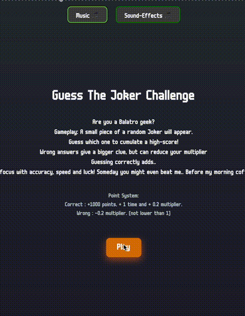
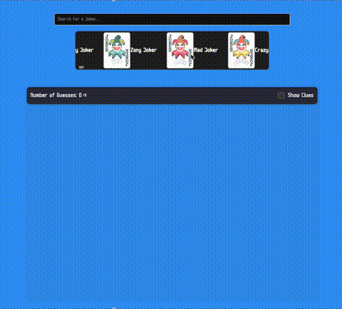
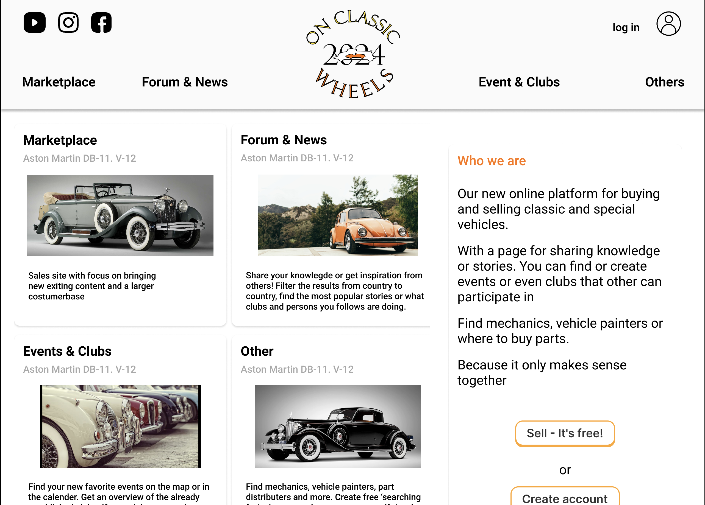
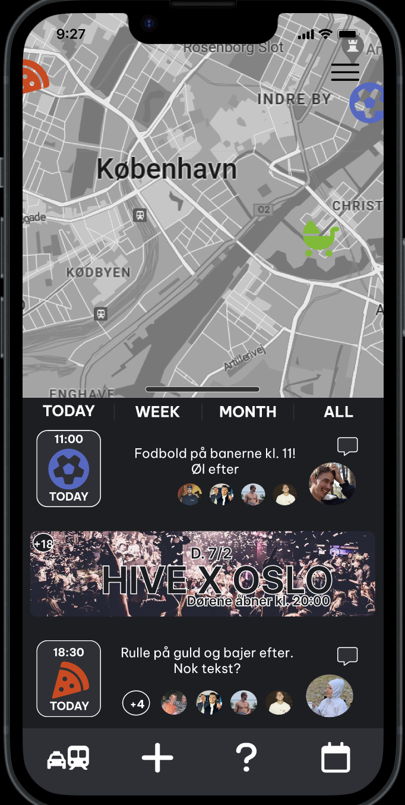
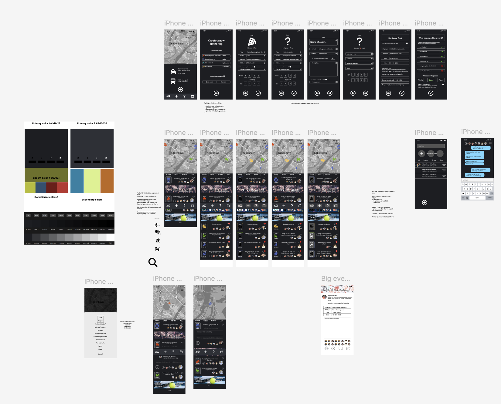

# 👋 Hi, I’m @FrederikVA

- 🎓 Currently studying Software Engineering at DTU (B.Eng.)
- 🛠 Background in Production Technology (KEA)
- 💡 Passionate about solving real-world problems through code and design
- 🧠 Hands-on with: Java, Kotlin, C, JavaScript (TypeScript, React), Python, SQL (MySQL/MariaDB), MicroPython
- 📫 Reach me at: fredasband@gmail.com
- 🔗 GitHub: [github.com/FrederikVA](https://github.com/FrederikVA)

---

## 🛠 My Personal Projects

### **BalatroGeek** *(inactive)*
A web-based calculator and minigame platform for the card game *Balatro*.
- Focus: complex front-end state logic, score calculations, and interaction flows (React, JavaScript).
- Features: mini-games, real-time result feedback, smooth state transitions.

#### 🎮 Minigame Snippets:
  

---

### **RoutineAnchor** *(active – [routineanchor.com](https://routineanchor.com))*
(*Server only active during test periods.*)  
A backend-oriented platform to help users anchor habits into daily routines.
- Focus: backend development, REST APIs, authentication, user data storage.
- Stack: React, C, Node.js, Express, MariaDB

---

### **OnClassicWheels** *(inactive)*
A classified platform for classic vehicle enthusiasts to buy/sell and engage in discussions.
- Focus: UX flow, data modeling, and backend design (React + MariaDB).
- Built with clear separation of listing logic and user interactions.

---

### **BarQueue** *(Figma Prototype)*
An early UI/UX exploration for managing bar orders efficiently.
- Designed using Figma
- Experimented with layout hierarchies, transitions, and accessibility

  

---

## 🧪 To Do
<!--
TODO:
- Add links to GitHub repos for each project
- Possibly break out project folders
- Optimize GIF sizes for mobile
- Add README to each project folder
-->
